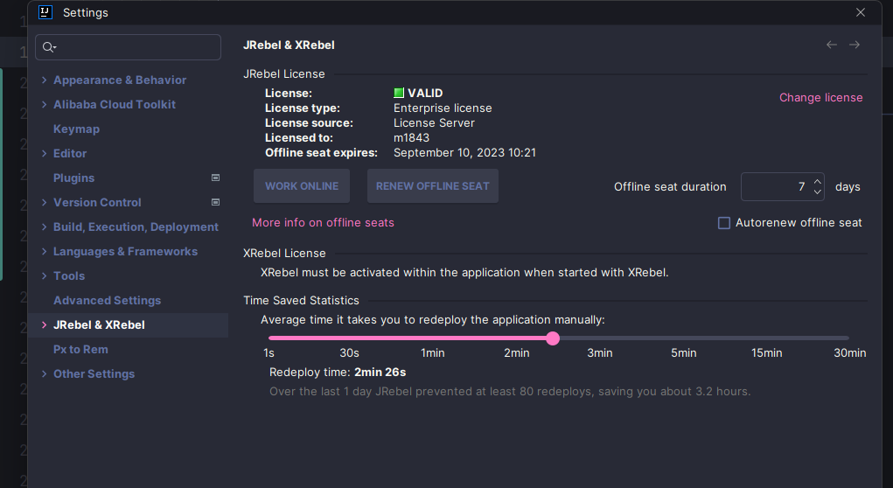
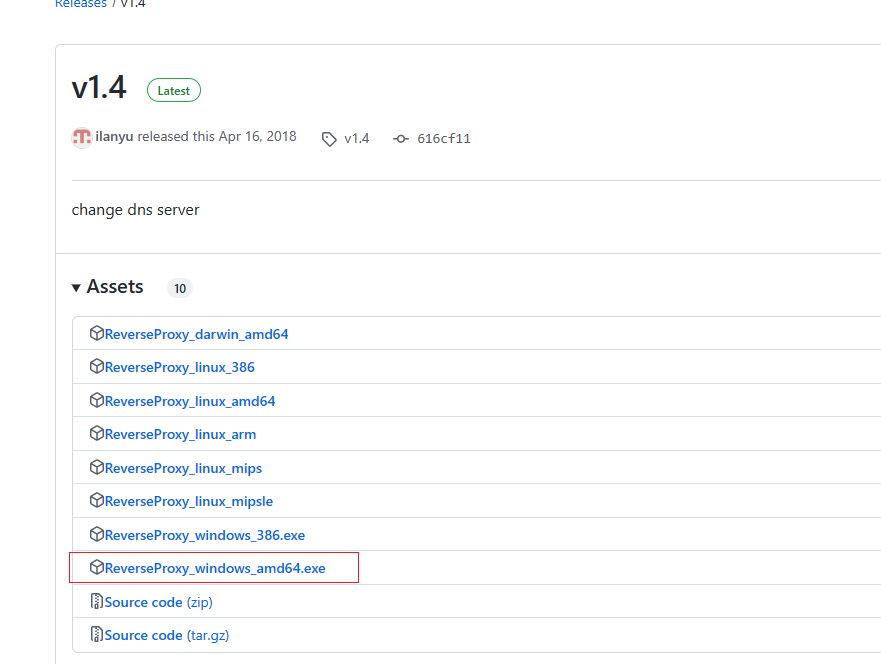
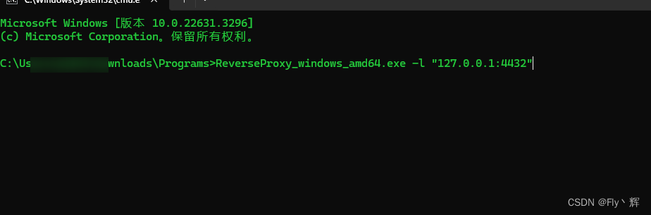
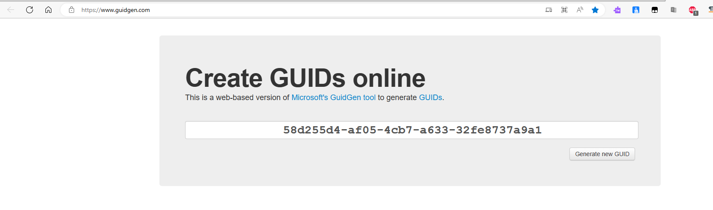
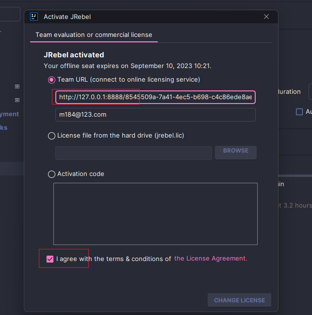
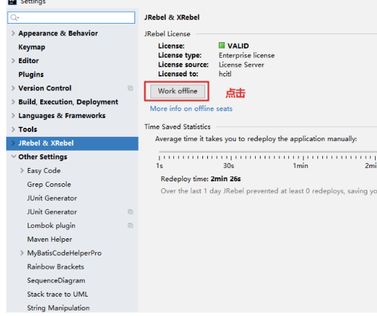

# ReverseProxy
ReverseProxy in golang

## Use:

	./ReverseProxy_[OS]_[ARCH] -h
	
	Usage of ReverseProxy_[OS]_[ARCH]:
	  -l string
	        listen on ip:port (default "0.0.0.0:8888")
	  -r string
	        reverse proxy addr (default "http://idea.lanyus.com:80")

	./ReverseProxy_windows_amd64.exe -l "0.0.0.0:8081" -r "https://www.baidu.com"
	
	Listening on 0.0.0.0:8081, forwarding to https://www.baidu.com

# JRebel本地激活方式（2023.4.2版本）

> 帖子出处 https://blog.csdn.net/weixin_43405647/article/details/129534195

## 先上图

### 1、先下载激活的exe（下图红框）

##### 地址：[Release v1.4 · ilanyu/ReverseProxy · GitHub](https://github.com/ilanyu/ReverseProxy/releases/tag/v1.4)

### 2、找到下载后文件的目录，进入cmd , -l + 127.0.0.1:+端口号(随意)

### 3、生成GUID

##### 地址：[Generate GUIDs online (guidgen.com)](https://www.guidgen.com/)

#### 4、打开Idea的JRebel激活界面。

##### 第一行：http://127.0.0.1:8888/{GUID}

##### 第二行：邮箱地址，随意输入，正确即可。例如[test@123.com](mailto:test@123.com)

##### 勾选同意，点击激活。

#### 5、离线工作

##### 激活后，下图红框点击。

